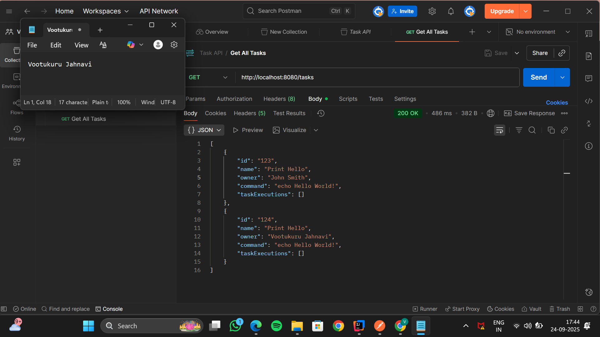
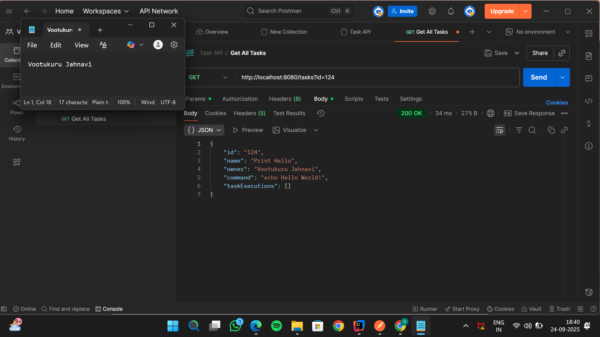
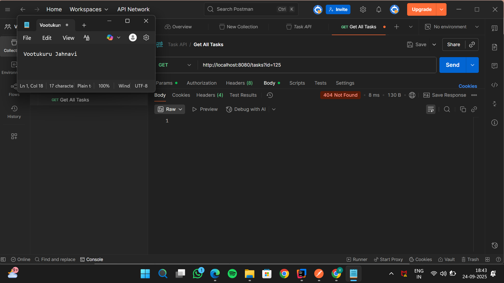
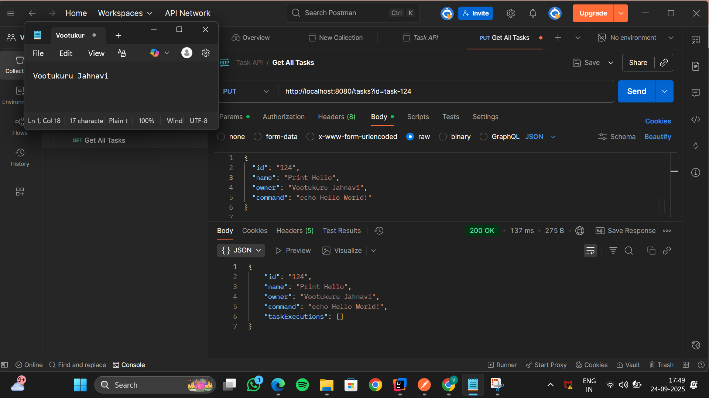
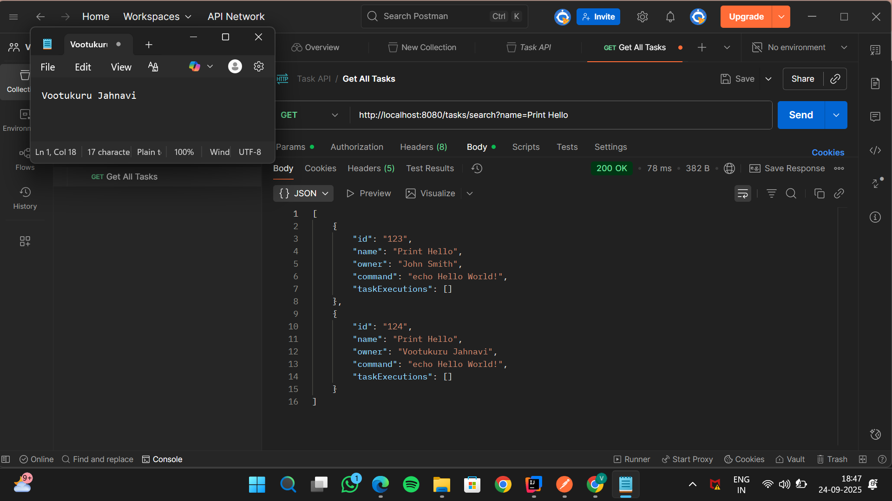
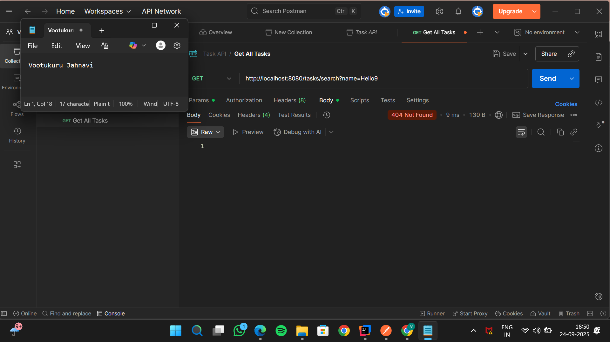
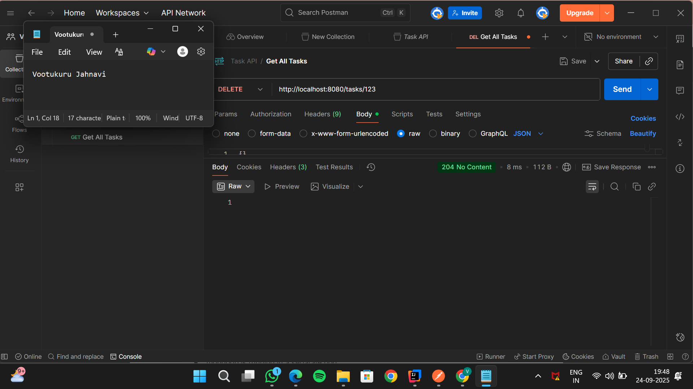
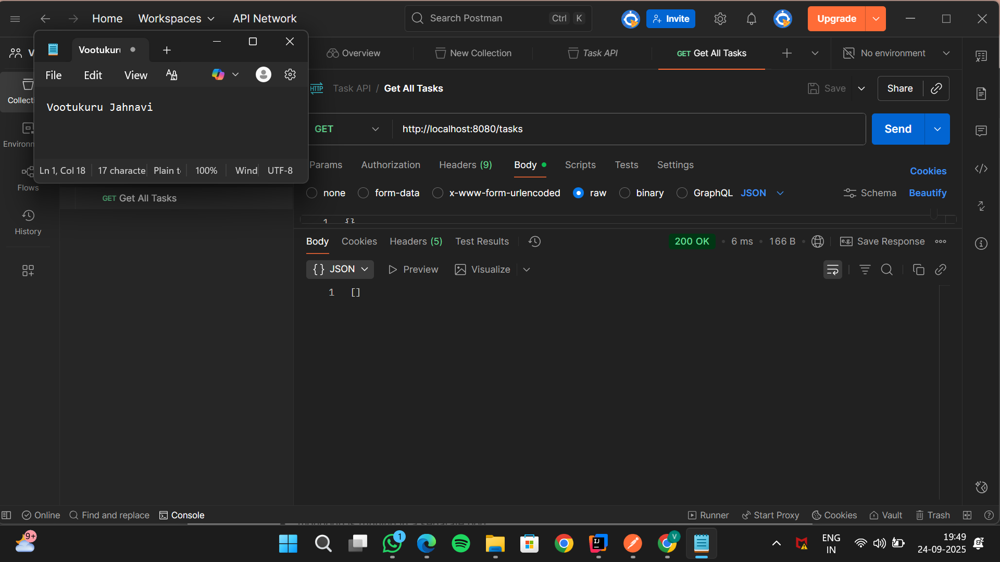
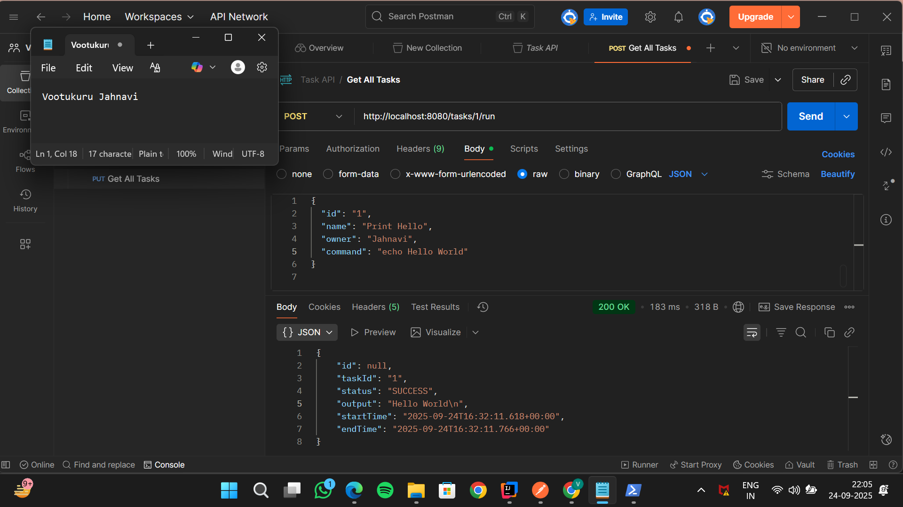

Task 1 - Java Task Manager REST API
**Author:** Vootukuru Jahnavi
**Date:** 24-09-2025

## Overview
This project implements a Java backend with a REST API for managing "task" objects.
Each task represents a shell command and can be executed ,storing execution details in MongoDB.
The API supports creating , deleting ,searching, and running tasks.

## Technologies Used
- **Java 17+**
- **Spring Boot**
- **MongoDB** (for storing Task objects)
- **Maven** (build tool)
- **Postman**(for API testing)
- **IntelliJ Idea**

## Project Structure
├── src
│ ├── controller/ # REST controllers
│ ├── model/ # Task and TaskExecution models
│ ├── repository/ # MongoDB repositories
│ ├── service/ # Business logic
│ └── TaskManagerApplication.java
├── src/main/resources/
│ └── application.properties
├── pom.xml
└── README.md
## API Endpoints
### GET/tasks
returns all tasks
Tested using Postman

### GET /tasks?id={id}
Returns a single task by ID . or If Not found Returns 404
### PUT/tasks
creates or updates a task . Body is Json. Example:
{
"id":"124",
"name":"Print Hello",
"owner":"Vootukuru Jahnavi",
"command":"echo Hello World"
}

### DELETE/tasks/{id}
Delete a task by ID.

### GET/tasks/find?name={string}
searches tasks by name substring

### POST /tasks/{id}/execute
Executes the task command and stores the output in taskExecutions list.

# Task Manager API

## Screenshots
Screenshots show my name and system date and time.

### 1. Create Task

### 2. Get All Tasks

### 3. Get Task by ID

### 4. Get Task by ID - Not Found (404)

### 5. Update Task by ID

### 6. Get Task by Name

### 7. Get Task by Name - Not Found

### 8. Delete Task

### 9. After Delete

### 10. Task Execution

